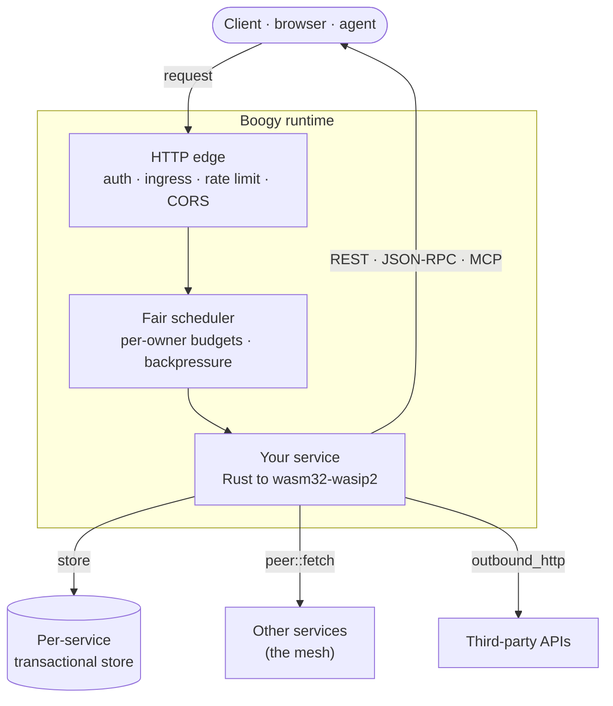
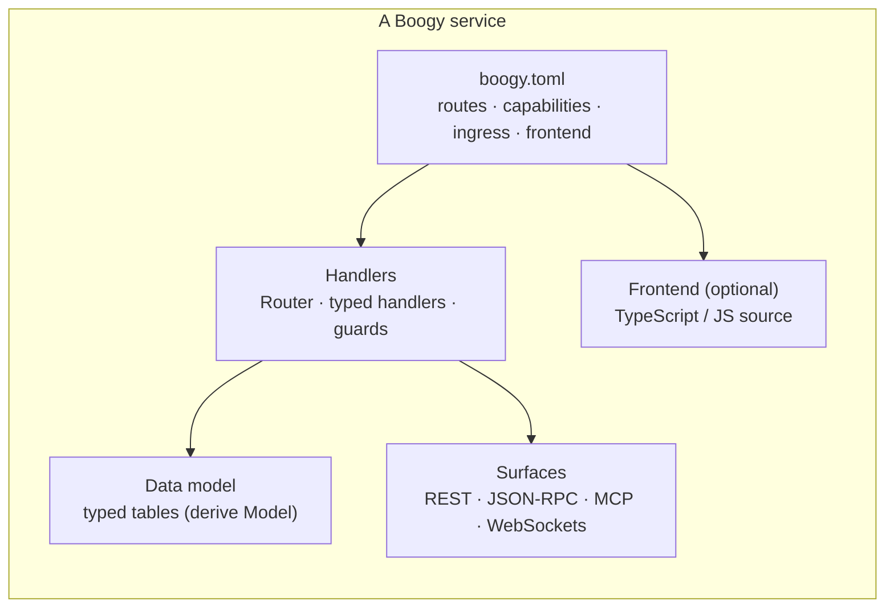
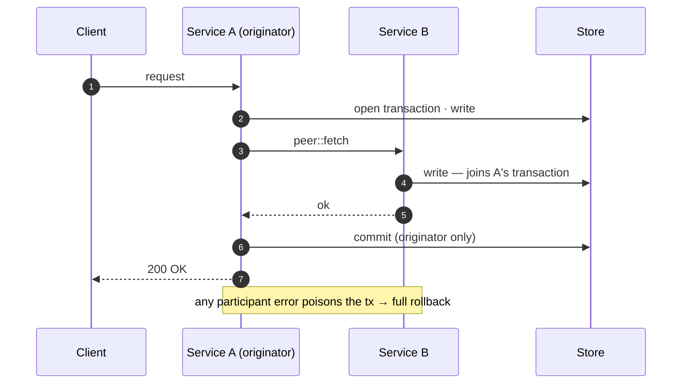
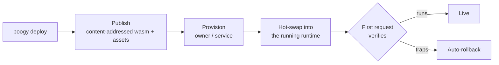

# Boogy architecture

Boogy is a platform for shipping **whole services** — frontend, API, and data —
from a single Rust crate compiled to `wasm32-wasip2`. You write handlers; the
runtime gives each service a route subtree, an isolated transactional store, a
set of capabilities, and REST / JSON-RPC / MCP surfaces. Services call each
other in-process, and a single transaction can span that call tree.

This document is the map: the big picture, the anatomy of a service, the
capability model, and a tour of every subsystem with a pointer to the skill
that teaches it.

> New here? Start with the [README](README.md) quickstart, then come back for
> the whole picture.

---

## The big picture

Every request enters through one edge that authenticates it, applies the
service's ingress policy and rate limits, and hands it to a fair scheduler
before a fresh instance of your wasm runs. Your handler reaches the outside
world only through **capabilities** it was granted — the store, other
services, third-party APIs, and so on. Nothing is ambient; everything is
declared.

---

## Anatomy of a service

A service is one crate. Its shape is declared in a `boogy.toml` manifest and
implemented with the SDK.

- **Manifest** (`boogy.toml`) — the contract: which routes the service owns,
  which capabilities it needs, its ingress mode, and an optional frontend.
  Capabilities are **deny-by-default**; you grant exactly what you use.
- **Handlers** — a `Router` dispatches typed handlers. Guards load and
  authorize resources into a typed context bag so handlers read them out
  without re-fetching.
- **Data model** — tables are declared with a derive macro and referenced
  through generated column constants, never bare strings.
- **Surfaces** — the same code can expose REST routes, a JSON-RPC dispatcher,
  and an MCP server for LLM clients; OpenAPI and OpenRPC documents are
  generated automatically.

---

## The capability model

Capabilities are the security boundary. A service can do nothing it hasn't
declared in `[capabilities]`, and each grant maps to one host-mediated
interface:

| Capability | What it grants |
|------------|----------------|
| `store` | The per-service transactional database (reads, writes, transactions). |
| `peer` | Calls to other services via `peer::fetch`. |
| `outbound_http` | Requests to third-party APIs over the network. |
| `background_jobs` | Enqueue durable jobs and cron schedules. |
| `websockets` | Declare channels and publish real-time messages. |
| `signing` | Sign payloads / verify upstream webhook signatures. |
| `auth` | Read the calling principal and scope data to it. |
| `clock`, `entropy`, `logging` | Time, randomness, and structured logs. |

Because grants are explicit, a service's blast radius is legible from its
manifest alone. → skill: `boogy-capability-limits`.

---

## Subsystem tour

Each subsystem below has a dedicated skill in
[Boogy Superpowers](https://github.com/Boogy-ai/boogy-superpowers) that teaches
an agent how to use it.

### Services & routing
A service owns a **route subtree** under `/{owner}/{service}`. The edge strips
the owner prefix once and dispatches the rest to your `Router`.
→ `designing-boogy-services`, `boogy-rest-apis`

### The transactional store
Every service gets its own isolated, **relational, ACID** database — fast,
scalable, and pay-per-use, with no provisioning step. Tables are modeled with
the derive macro; multi-row transactions are always available.
→ `boogy-data-modeling`, `boogy-access-patterns`

### Cross-service calls (the mesh)
Services call each other through `peer::fetch` — an in-process dispatch, not a
network hop. The host strips identity-bearing headers on every hop, so a callee
can't impersonate the caller's credentials.
→ `boogy-mesh-architecture`

### Cross-service transactions
The differentiator: a transaction opened by a caller spans the **entire
`peer::fetch` call tree as one transaction**. Each callee's store operations
auto-join it; only the originating service commits; any participant failure
poisons the transaction so nothing partially applies.

→ `boogy-transactions`

### API surfaces
One service, three ways to call it: **REST** (typed `Router` handlers),
**JSON-RPC** (a dispatcher), and **MCP** (tools/resources/prompts for LLM
clients) — all behind the same auth. Specs (OpenAPI 3, OpenRPC) are generated.
→ `boogy-rest-apis`, `boogy-mcp-services`, `boogy-api-specs`

### Serving frontends
A deployment can serve a web frontend decoupled from the wasm. You ship
TypeScript/JS **source** — no JS toolchain required — and the control plane
transpiles it at deploy time and serves the assets directly, versioned with the
wasm. A manifest can describe a frontend-only deployment, a full-stack one, or a
plain service.
→ `boogy-serving-frontends`

### Auth & identity
Callers are **principals** (a human, an agent, or another service's workload
identity). Auth flows through signed tokens and API keys; resource-level helpers
scope every row to its owner with a deny-by-existence mask (missing and
not-yours both return 404).
→ `boogy-auth`, `boogy-account-auth`

### Ingress & access control
Each service picks an ingress mode — `public`, `authenticated`, `allowlist`,
`internal`, or `mixed` — plus per-service rate limits and a default-deny CORS
allowlist. On-behalf-of delegation lets one service act for a user, opt-in per
receiver.
→ `boogy-obo-delegation`

### Background jobs
Enqueue durable work that outlives the request, with retries and manifest-declared
cron schedules. Jobs enqueued inside a transaction only fire once it commits.
→ `boogy-background-jobs`

### Real-time WebSockets
Declare channels in the manifest (public or private, with an optional replay
ring) and publish messages from your service. Private channels are subscribed
with short-lived signed grants.
→ `boogy-websockets`

### Outbound HTTP, signing & secrets
Reach third-party APIs with `outbound_http`, sign or verify payloads with
`signing`, and bind per-service **secrets** (encrypted at rest) that your wasm
uses without ever reading the raw key material in some flows.
→ `boogy-outbound-http`, `boogy-signing`, `boogy-secrets`, `boogy-webhooks`

### Scheduling, fairness & limits
Every request passes through per-owner fair scheduling before it runs, and
carries a wall-clock budget. Two backpressure signals keep the platform fair:
**429** when a single service is too fast, **503 + Retry-After** when the host
is contended, and **504** when a request exceeds its budget.
→ `boogy-performance-and-scaling`, `boogy-capability-limits`

### Observability
Usage and audit events, Prometheus metrics, a guest-log ring buffer, and a
streaming gateway give you per-service visibility into requests, latency, and
errors.
→ `boogy-observability`

---

## Deploy lifecycle

`boogy deploy` publishes the wasm (and transpiles any frontend), then provisions
it for an owner and hot-swaps it into the running host with no downtime. A first
request verifies the new version actually runs; a trap auto-rolls-back to the
previous one.

→ `boogy-service-lifecycle`, `deploying-boogy-services`,
`boogy-registry-and-provisioning`

---

## The toolchain

| Crate | Role |
|-------|------|
| `boogy-sdk` | `Router`, typed handlers, `wit_glue!`, store helpers, auth guards, `McpServer`. |
| `boogy-wit` | The WIT interface definitions — the `service` world your component implements. |
| `boogy-sdk-macros` | `#[derive(Model)]` and friends. |
| `boogy-auth-core` | API-key format primitives used by the auth guards. |
| `boogy-cli` | The `boogy` CLI — build, deploy, and manage services. |

---

## Where to go next

- **Build something** — the [README](README.md) quickstart + the
  `smoke/` starter service.
- **Teach your agent** — [Boogy Superpowers](https://github.com/Boogy-ai/boogy-superpowers),
  the skills that turn this architecture into working code.
- **Start from a working example** — the
  [catalog](https://github.com/Boogy-ai/boogy-catalog) of provisionable,
  best-practice services.
- **The platform** — [boogy.ai](https://boogy.ai).
